# Rapport mini-projet IoT


Bachri Anas<br>
Alex Fouilleul 

Polytech Grenoble - IESE5<br>
2022 - 2023

<p align="center">
  
</p>

## Introduction

Nous avons disposé de quelques séances de TP réalisées au fablab MSTIC de l'UGA. Le but étant de créer un système "évolutif" prenant en compte des capteurs et réalisant une communication sans fils type LoRa ou encore Bluetooth.
Dans le cadre de ce projet nous avons choisis un compteur de personnes que nous avons très vite fait évoluer afin d'en faire une alarme de détection.

A noter que pour avoir un bref apercu du projet nous avons rédigé, en anglais, la page [readme.md](https://github.com/AlexFouilleul/Detection-alarm/blob/main/README.md) du dépot. Cependant ce compte rendu sera bien plus complet et expliquera les différents points pris en compte lors du travail autour de ce projet et son étude de cas.


## Analyse rapide du marché

Dans le cas d'une alarme, le prix des produits des concurrents peut très vite monter. Cela s'explique avant tout par les produits que ceux-ci proposent (avec une centrale intérieure/extérieure ainsi que un ensemble de capteurs tels que des capteurs d'ouvertures de portes ou de détection de présence). En se référent au site de [Leroy Merlin](https://www.leroymerlin.fr/produits/electricite-domotique/alarme-telesurveillance/alarme-maison/alarme-maison-sans-fil/) on peut très vite se rendre compte des prix allant d'une centraine d'euros jusqu'au millier d'euros. A noter que ce genre d'alarme  est en général très robuste avec des équipements robustes résistant au temps. Elles sont donc pensées pour une durée de vie de plusieurs dizaines d'années avec en général une sécurité et fiabilité relativement élevées.

<p align="center">
  
  <br>
  <i>Alarme classique : PowerMaster Kit4</i>
</p>

Un autre type de système tout aussi intéressant sur lequel on peut se pencher sont les centrales domotiques tel que la [Gateway Xiaomi](https://xifrance.com/product/xiaomi-gateway-v3/). Ce genre de produit repose sur la même approche que les alarmes avec une centrale intérieure et un ensemble de capteurs qui s'y connecte en utilisant différents protocoles tels que le Wifi (pour piloter la centrale à distance), ainsi que le Bluetooth et le Zigbee pour se connecter aux capteurs. Ce type de système peut être utilisé comme une alarme d'appoint et dispose de nombreux avantages qui seront énumérés plus bas dans ce compte rendu.

<p align="center">
  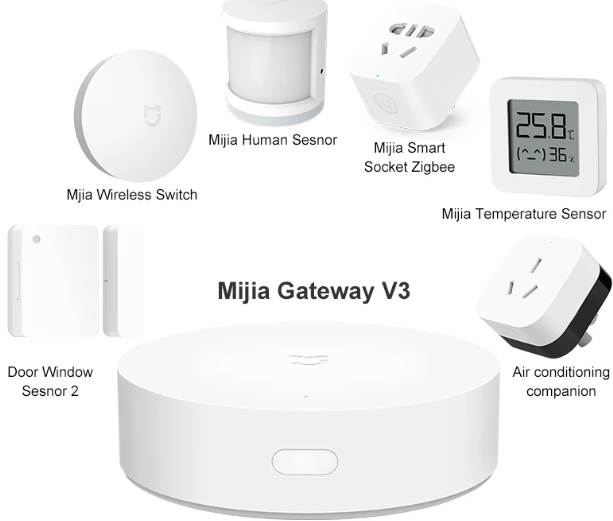
  <br>
  <i>Centrale domotique : Xiaomi Mijia Gateway V3</i>
</p>

Avec les quelques séances de projet dont nous disposons, nous avons fait le choix de mélanger les deux types d'alarme vu précédemment et de concevoir un boîtier unique disposant de l'ensemble des capteurs dont nous avons besoin. Cette solution nous permettra de développer rapidement le système et le tester tout en pouvant toucher aux différents aspects de ce projet et respecter des contraintes de ressources et de coûts.


## Architecture globale du système

L'idée étant d'avoir une solution clé en main, l'objet est donc un boîtier contenant l'ensemble du système. 
Afin de le mettre en place il faut donc les éléments suivants : 
- Le boîtier contenant le système
- Une surface sur laquelle fixer le boîtier
- Une alimentation (comprise entre 3 et 20V) ou un chargeur de téléphone (5V) et un câble micro-USB

Le but étant de placer le boîtier à une distance relativement haute afin qu'il ne puisse être atteint trop rapidement.

### Fonctionnalités

Le système ainsi installé est capable de réaliser les fonctionnalités suivantes :
- Détection de personnes avec un angle de 120 degrés à une distance maximum de 6 mètres.
- Retourne d'informations avec un effet de lumière grâce au bandeau de LED :
  - Lumière totalement bleu = le système est connecté au Bluetooth et l'alarme est inactive.
  - Lumière bleu au centre et rouge aux extrémités = le système est connecté au Bluetooth et l'alarme sera activée après déconnexion.
  - Lumière rouge avec pulsations = le système a détecté quelqu'un et l'alarme sonne.
- Détection de fixation au mur. Si une personne décroche le système du mur, l'alarme le détecte et sonne.
- Communication Bluetooth basse consommation.
- Peu coûteux
- Contrôlable avec une application Android permettant de :
  - Activer/désactiver l'alarme.
  - Voir combien de personnes ont été détectées.
  - Voir l'historique des détections.

https://user-images.githubusercontent.com/72225568/212143804-26f251a3-b9e0-4fa7-94d8-73f0c1a2abcc.mp4

https://user-images.githubusercontent.com/72225568/212143959-f46ecb38-8674-4406-8a82-b690112cbbb5.mp4


## Sécurité globale

Un système de ce type peut comporter différents aspects de sécurité.

Tout d'abord l'un des éléments de sécurité peut être l'accès physique au boîtier. C'est pour cette raison que nous avons en plus rajouté un bouton poussoire qui permet de vérifier la bonne fixation du boîtier sur le mur. Mais cet aspect dépend aussi de l'environnement dans lequel le système est, et surtout de là où celui-ci est placé. Le système reste avant tout un prototype et, qui plus est, fonctionne sur secteur donc à la moindre coupure de courant ou accès à celui-ci une personne pourra potentiellement dégrader le système.

Outre l'aspect sécurité physique, on retrouve aussi l'aspect confidentialité (décrit dans la partie suivante) ainsi que la partie échange de données via un protocole sans fil. A cet effet on retrouve de nombreux articles en lignes evoquant la sécurité des protocoles de communications sur le Bluetooth Basse Consommation (BLE) dont le site [Vaadata](https://www.vaadata.com/blog/fr/bluetooth-low-energy-securite-objets-connectes/) fait office : `un objet peut être vulnérable à cause soit de failles du standard lui-même, soit d’un mauvais choix parmi les fonctionnalités (notamment au niveau de l’appairage), ou soit d’une mauvaise implémentation du BLE`. Par conséquent nous avons fait attention aux informations échangées et à la manière dont nous avons programmé notre système. C'est par la même occasion que nous en avons profité afin d'ajouter un code PIN permettant de verrouiller les actions sur notre système et éviter que n'importe qui puisse s'y connecter.


## Respect de la vie privée (RGPD)

La protection de la vie privée est un aspect important à prendre en compte pour les alarmes, en particulier pour les alarmes connectées qui peuvent collecter, stocker et transmettre des données personnelles. Le [Règlement Général sur la Protection des Données (RGPD)](https://www.cnil.fr/fr/reglement-europeen-protection-donnees) de l'Union Européenne est une réglementation qui vise à protéger les données personnelles des citoyens de l'Union Européenne. Il impose des obligations aux entreprises qui traitent des données personnelles, y compris les fabricants et les distributeurs d'alarmes.

Pour respecter le RGPD, les fabricants et les distributeurs d'alarmes doivent :
- Notifier les utilisateurs de la collecte, de l'utilisation et de la transmission de leurs données personnelles, ainsi que de leurs droits en matière de protection des données.
- S'assurer que les utilisateurs donnent leur consentement explicite pour la collecte, l'utilisation et la transmission de leurs données personnelles.
- Sécuriser les données personnelles stockées et transmises pour éviter les fuites de données ou les accès non autorisés.
- Respecter les demandes des utilisateurs en matière d'accès, de rectification ou de suppression de leurs données personnelles.
- Nommer un délégué à la protection des données (DPO) si les traitements de données sont importants en termes de quantité, de sensibilité ou de risque pour les droits et libertés des personnes concernées.
- Notifier les autorités de protection des données et les personnes concernées en cas de violation de la sécurité des données.

Il est important de noter que les fabricants et les distributeurs d'alarmes, dont nous, doivent s'assurer de respecter toutes les exigences du RGPD pour éviter les pénalités financières élevées qui peuvent aller jusqu'à 4% du chiffre d'affaires annuel ou 20 millions d'euros, selon le cas le plus élevé. Il est donc important pour nous de nous assurer de disposer des outils et des ressources nécessaires afin respecter les exigences de cette réglementation.


## Architecture matérielle de l'objet

Afin de mener à bien ce projet nous avons utilisé différents éléments qui sont les suivants :
- Un [Arduino Tiny Machine Learning Kit](https://store.arduino.cc/products/arduino-tiny-machine-learning-kit) qui est basé sur une Arduino Nano 33 BLE Lite. Cette carte est spécifiquement conçue pour les projets IoT. En effet, elle dispose de nombreux éléments dont : 
  - une connection BLE (Bluetooth Low Energy) : utilisée afin d'envoyer des informations au smartphone.
  - un capteur faisant office d'accéléromètre, magnétomètre et gyroscope : non utilisé dans notre projet car le boîtier sera fixé.
  - un capteur de proximité : non utilisé car son utilisation est limitée dans le cadre de notre projet.
  - un microphone omnidirectionnel : non utilisé pour l'instant mais qui pourra être intégré plus tard.
- Un [Grove buzzer](https://wiki.seeedstudio.com/Grove-Buzzer/) piézo permettant de jouer des sons.
- Un [Grove PIR sensor](https://wiki.seeedstudio.com/Grove-PIR_Motion_Sensor/) afin de détecter la présence d'une personne.
- Un [Grove bouton](https://wiki.seeedstudio.com/Grove-Button/) qui a pour but de vérifier que le boîtier est bien fixé au mur.
- Un bandeau de LED adressables WS2812B permettant un retour d'informations visuelles.

L'ensemble des composants sont connectés de la manière suivantes : 

<p align="center">
  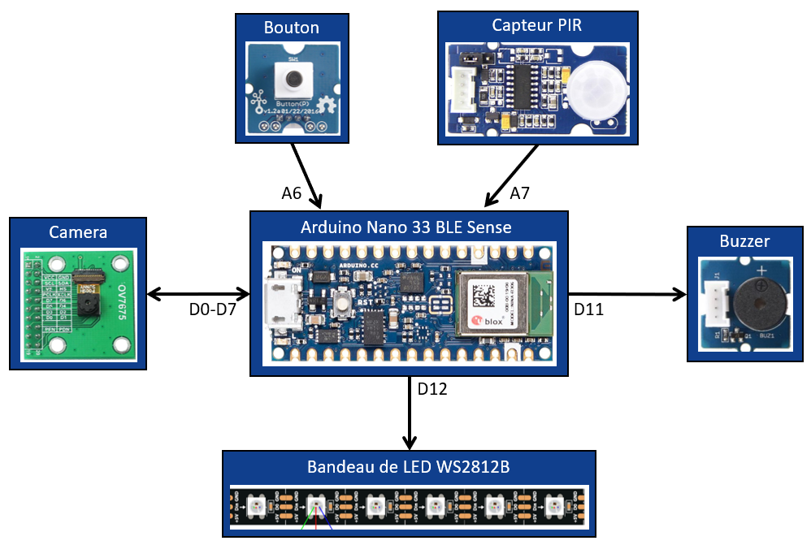
  <br>
  <i>Schéma de connexion des composants du système</i>
</p>

<u>Remarque :</u> On notera que l'Arduino ne peut fournir qu'une tension de 3,3V.

D'autres éléments sont également utilisés comme :
- Une alimentation mise en place à l'aide d'un chargeur de téléphone et un câble micro-USB.
- Un boîtier conçu à l'aide d'une découpeuse laser et d'une plaque de contreplaqué de 3 mm.

<p align="center">
  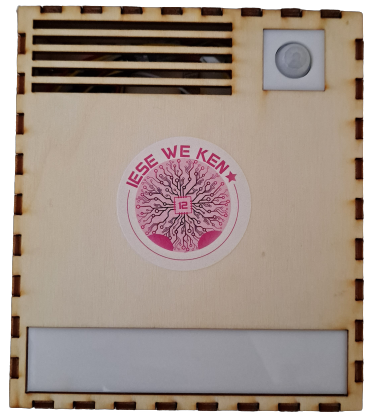
  <br>
  <i>Boitier du système assemblé</i>
</p>

Ce boîtier a été réalisé dans un premier temps avec le site [MakerCase](https://fr.makercase.com/#/) et qui permet d'obtenir une boîte très rapidement et simplement en lui renseignant les cotations. Par la suite on récupère le fichier .svg qu'il génère afin de l'éditer sur le logiciel [Inkscape](https://inkscape.org/fr/). Dans un second temps on vient donc éditer le schéma de notre boîte afin d'inclure les trous pour les capteurs, câble et fixations. On en profite également pour concevoir une plaque faisant office de support murale. Le tout est fixé en utilisé de la colle à bois pour les parties du boîtier. Quant aux capteurs, ceux-ci sont fixés avec du ruban mousse double face permettant de bien faire tenir les capteurs tout en les conservant afin de les restituer au Fablab une fois le projet terminée.

<p align="center">
  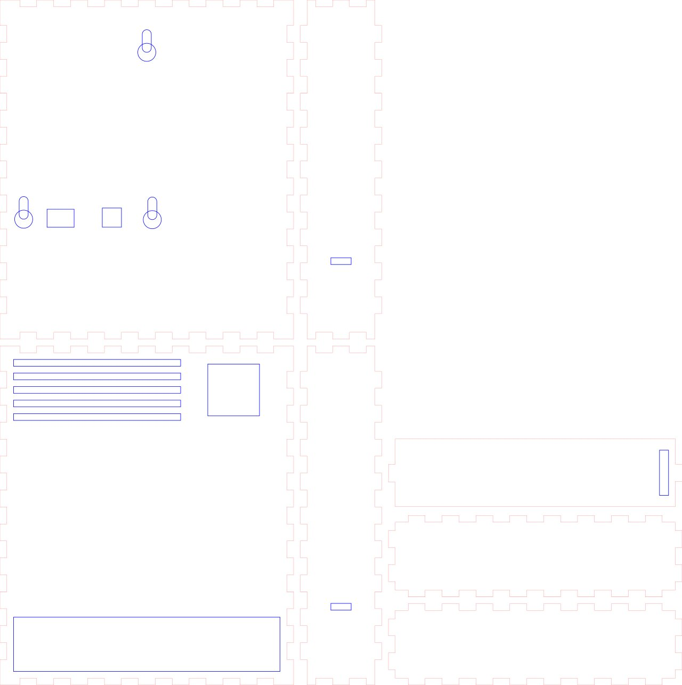
  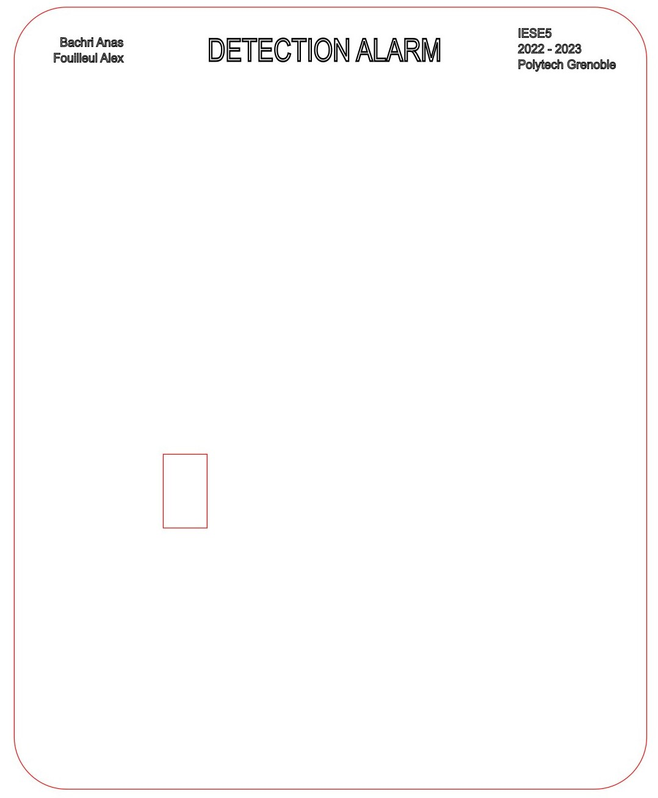
  <br>
  <i>Parties constituants le boîtier</i>
</p>

Une fois construit le boitier possède les dimensions suivantes (L\*l\*p) : 15\*13\*3,6 mm

## Estimation de la BOM de notre produit

La BOM est la liste complète de toutes les pièces et matières utilisées afin de fabriquer ce produit. Pour la réaliser, on se base sur une estimation de production de l'ordre de 5000 unités produites. On dresse alors le tableau suivant :

| Matériel | Quantité | Prix unitaire | Prix de groupe | Revendeur | Remarque |
| -------- | -------- | ------------- | -------------- | --------- | -------- |
| Arduino Tiny Machine Learning Kit | 5000 | 50,40 € | 252 000 € | [Arduino](https://store.arduino.cc/products/arduino-tiny-machine-learning-kit) | Cable micro USB inclus |
| Buzzer Grove | 5000 | 1,06 € | 5 300 € | [SeeedStudio](https://www.seeedstudio.com/Grove-Buzzer.html) | |
| Bouton Grove | 5000 | 1,30 € | 6 500 € | [SeeedStudio](https://www.seeedstudio.com/Grove-Button.html) | |
| PIR Grove | 5000 | 6,10 € | 30 500 € | [SeeedStudio](https://www.seeedstudio.com/Grove-PIR-Motion-Sensor.html) | |
| Cable Grove  | 4000 | 2,20 € | 8 800 € | [SeeedStudio](https://www.seeedstudio.com/Grove-Universal-4-Pin-20cm-Unbuckled-Cable-5-PCs-Pack-p-749.html) | Lot de 5 cable Grove de 20 cm |
| Bandeau LED WS2812B | 100 | 14,69 € | 1 469 € | [Aliexpress](https://fr.aliexpress.com/item/1005002890783311.html) | Longueur 5m - Densité 60LED/m - Protection IP65 |
| Chargeur de téléphone | 5000 | 4,84 € | 24 200 € | [RS Components](https://fr.rs-online.com/web/p/adaptateurs-ac-dc/2237481) | Puissance : 5V - 1A |
| Contreplaqué | 455 | 16,59 € | 7 549 € | [Leroy Merlin](https://www.leroymerlin.fr/produits/menuiserie/panneau-planche-et-materiaux-bois/panneau-bois-agglomere-mdf/panneau-bois-recoupable/panneau-contreplaque-peuplier-ep-3-mm-x-l-100-x-75-cm-82707642.html) | Surface unitaire = ~675 cm² |
| Vis | 38 | 6,90 € | 263 € | [Leroy Merlin](https://www.leroymerlin.fr/produits/quincaillerie/cheville-vis-clou-et-boulon/vis/vis-a-bois/lot-de-400-vis-acier-tete-fraisee-standers-diam-4-mm-x-l-16-mm-82231848.html) | Lot de 400 vis avec un diamètre de la tige de 4 mm |
| Colle à bois | 50 | 9,90€ | 495 € | [Leroy Merlin](https://www.leroymerlin.fr/produits/peinture-droguerie/colle-et-adhesif/colle/colle-a-bois/colle-a-bois-rapide-axton-500-gr-80104801.html) | |

Ce qui nous donne un total de **337 076 €** à débourser pour concevoir 5000 unités. Quant au prix unitaire celui-ci revient donc à **67,42 €**.

A noter que l'on utilise ici des revendeurs officiels sauf pour le bandeau de LED introuvable sur ce genre de site. 
De plus, certains prix pourraient être revus à la baisse en faisant de l'optimisation (notamment avec l'espace lié à la découpeuse laser).
Etant donné que l'on utilise pas la caméra présente sur le kit, on pourrait aussi commander seulement l'[Arduino Nano 33 BLE](https://store.arduino.cc/products/arduino-nano-33-ble) (en version non *sense*) permettant d'économiser 27€ sur chaque unité !
Les prix peuvent également être négociés étant donné l'achat de groupe conséquent fait pour 5000 unités et que les sites actuels ne prennent pas en compte.

La BOM réalisée ci-dessus ne prend pas en compte les coûts liés à l'utilisation des machines du type découpeuse laser ou encore la main d'œuvre pour l'assemblage de l'ensemble.


## Estimation du coût des certifications

Une des certifications qui nous vient à l'esprit pour ce genre de système et en accord avec les cours suivis à Polytech Grenoble, est la compatibilité électromagnétique (CEM) car notre système utilise notamment une communication Bluetooth. D'après le site [Rtone](https://blog.rtone.fr/essais-cem) le coût de cette certification peut se situer ```entre 8k€ et 50k€ dans le domaine de l'IoT```. Le prix exact de cette certification est difficilement quantifiable sans demander de devis car cela dépend de sa complexité (radio notamment) et aussi selon la quantité de pays ciblés. En fonction de ces différents points l’écart peut être important mais cette phase est obligatoire afin de commercialiser un tel produit.

Pour un produit vendu en France il faut également s'intéresser aux normes NF et CE et qui indique que nous, fabricants, nous engageons sa responsabilité sur la conformité du produit à l'ensemble des exigences fixées par la législation française et également de l'Union européenne applicable à ce produit. Pour ce faire, il faut réaliser des contrôles et essais qui assurent la conformité du produit aux exigences essentielles définies dans les textes européens concernés. Plus d'informations sont données sur le site du [ministère de l'économie et des finances](https://www.economie.gouv.fr/dgccrf/Publications/Vie-pratique/Fiches-pratiques/Le-marquage-CE).

Enfin une autre norme auquel on pourrait penser concerne le bruit que peut émettre l'alarme. Des réglementations en France imposent une limite de puissance sonore des sirènes à 105 décibels et leur durée de fonctionnement à 3 minutes. Le signal sonore qu'elle émet doit aussi être différent de celui des services d'urgence et de secours (SAMU, pompiers, police, gendarmerie, etc).


## Définition et implémentation du logiciel embarqué de l'objet

Le logiciel embarqué est un code développé sous l'IDE Arduino pour notre Arduino Nano 33 BLE.

Afin de pouvoir programmer la carte il faut dans un premier temps configurer l'environnement de programmation en ajouter la carte à l'aide de la librarie [ArduinoBLE](https://www.arduino.cc/reference/en/libraries/arduinoble/). 

Afin de gérer les LED on utilise la librarie [Neopixel](https://github.com/adafruit/Adafruit_NeoPixel) d'Adafruit disposant de fonctions permettant de réduire grandement la façon de gérer notre bandeau de LED. Nous utilisons principalement cette librarie afin de gérer la couleur et luminosité des LED.

Pour le reste des composants ceux-ci sont tous connectés à des GPIO digital et fonctionne de la façon suivante : 
- la capteur PIR renvoie un signal à l'état haut (1) lorsqu'il détecte une personne. Il suffit juste de lire le port qui lui est associé.
- le buzzer émet un son lorsqu'on lui applique une fréquence. Une fonction *tone* issue d'Arduino permet de le gérer.
- le bouton renvoie un signal à l'état haut (1) lorsqu'il est maintenu, et à l'état bas (0) sinon. Attention, dans le cadre de notre prototype le code du bouton fait en sorte d'activer l'alarme si celui-ci est appuyé et non relaché.

Le code est décomposé en 5 fonctions qui sont les suivantes :
- **setup()** : fonction qui initialise l'ensemble des composants de notre système et paramètre le Bluetooth de notre carte Arduino.
- **loop()** : boucle principale de notre système qui gère ses différents états.
- **runBuzzer()** : fonction qui permet à l'alarme de jouer un son et activer ses LED lorsqu'elle détecte quelqu'un.
- **stopBuzzer()** : fonction qui arrête le buzzer et remet les LED dans le même état qu'avant.
- **setAlarmState()** : fonction qui gère l'activation ou la désactivation de l'alarme en fonction de la valeur reçue en Bluetooth.

Notre code est programmé de façon à suivre ce fonctionnement :
<p align="center">
  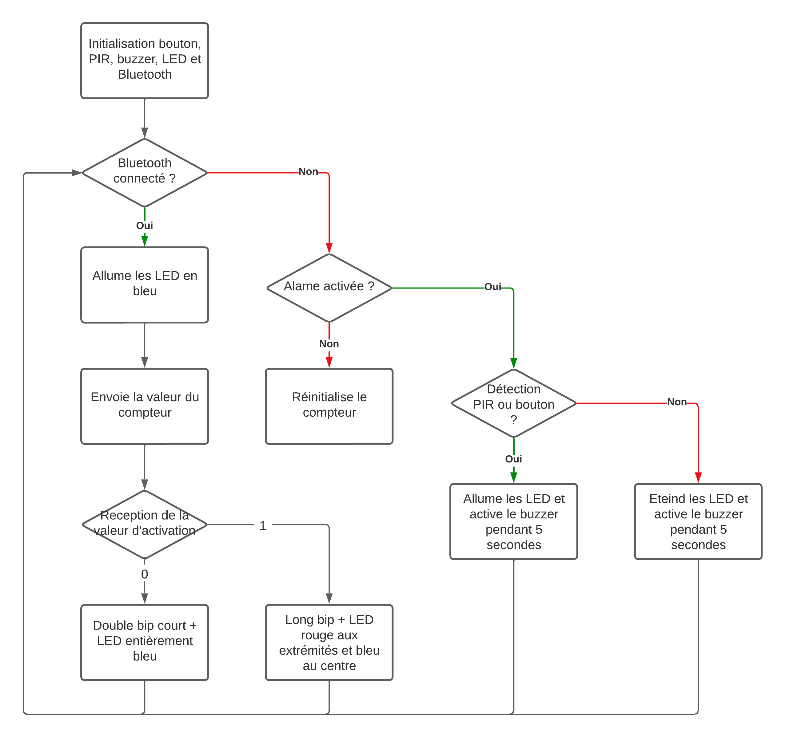
  <br>
  <i>Schéma de connexion des composants du système</i>
</p>


## Format des messages échangés

Le Bluetooth Basse Consommation (BLE) est un dérivé du Bluetooth utilisé pour les objets connectés et ayant une consommation bien plus faible. Le protocole d’échange est différent d’une connexion Bluetooth classique car il propose des services utilisant un ou des identifiants uniques (nommé caractéristiques) pour les reconnaître.

Le modèle d'Arduino mis à notre disposition est capable d’utiliser le BLE. Nous l’avons alors paramétré de façon à contenir un service avec trois caractéristiques permettant l'échanges d'informations dont chaque service permet de :
- envoyer le nombre de personnes détectées.
- activer/désactiver l'alarme.
- entrer le code PIN du système. 
Les caractéristiques conçues reposent sur des identifiants uniques (UUID) dérivés de l'identifiant principal de notre Arduino. Afin d'obtenir un identifiant de ce genre pour notre Arduino on peut utiliser des générateurs d'UUID en ligne comme [celui-ci](https://www.uuidgenerator.net/).

Le tout est illustré de la façon suivante :

<p align="center">
  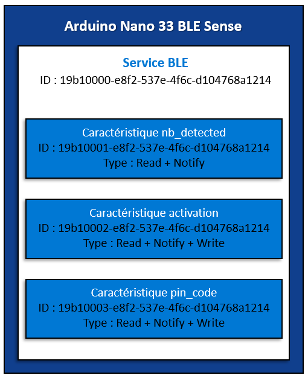
  <br>
  <i>Schéma de l'intégration du Bluetooth du système dans l'Arduino</i>
</p>

Les informations échangées par la communication Bluetooth sont du type unsigned little-endian.

Pour résumer le système est capable de communiquer à travers ses caractéristiques de telle façon et avec le schéma ci-dessous :
- nb_detected : cette caractéristique ne peut qu'être lue. Elle renvoie le nombre de personne détectée par le système quand celui-ci est activé.
- activation : cette caractéristique peut être lue et écrite. Elle permet de connaitre l'état dans lequel l'alarme est (0 = désactivé, 1 = activé). L'utilisateur peut également définir l'état de l'alarme en envoyant lui même la valeur (0 ou 1) pour définir l'état du système.
- pin_code : caractéristique qui peut également être lue et écrite et qui permet d'envoyer le code pin au système. Celui-ci va alors vérifier s'il est correct et va renvoyer une information connaissant son état (0 = incorrect, 1 = correct)


## Métriques du logiciel embarqué

Afin de mener à bien ce projet, nous avons rédigé 112 lignes de code en C sous l'IDE Arduino. Afin de réduire ce nombre de lignes de code nous avons utilisé des librairies déjà conçues et permettant de grandement gagner du temps face au peu de temps dont nous disposons. Le projet est assez compact puisque sa taille n'est que de 322 ko soit 32% de l'espace de stockage de programmes de notre carte Arduino. Quant aux variables globales, elles occupent 69 ko soit 29% de mémoire physique dynamique d'après le compilateur.

Concernant l'application développée sous MIT App Inventor celle-ci ne fonctionne pas sous forme de ligne de code mais sous forme de blocs à empiler (façon Scratch). Par conséquent, il est difficile de quantifier le travail réalisé mais nous avons cependant essayé de faire des blocs génériques afin qu'ils puissent facilement s'adapter aux services Bluetooth dont nous disposons. Cette démarche nous a ainsi permis de gagner du temps là encore. La taille de l'application dans son état actuel est de 3,57 Mo.

L'ensemble du code est disponible dans les répertoires [Arduino](https://github.com/AlexFouilleul/Detection-alarm/tree/main/Arduino) et [Application](https://github.com/AlexFouilleul/Detection-alarm/tree/main/Application). 

Les ressources utilisées pendant ce projet sont quant à elles disponibles [ici](https://github.com/AlexFouilleul/Detection-alarm/blob/main/Report/resources.md).


## Mesure des temps des phases d'éxécution

Lors de l'exécution de notre système nous avons relevé différents temps de mesures pour les principales phases et qui sont les suivantes :
- **Phase de surveillance :** lors de la surveillance, le système analyse la pièce toutes les 3 secondes. Cette durée est relative au délai minimum d'analyse lié au capteur PIR. 
- **Phase d'alerte :** lorsque le système a détecté une personne, celui-ci fait fonctionner le buzzer et les LED en faisant varier leur intensité. Le système répète ainsi 5 cycles ayant chacun un délai d'une seconde ce qui nous donne un temps total de 5 secondes pour cette phase.
- **Phase de communication Bluetooth :** pour cette phase nous n'avons pas de métrique étant donné que le temps de communication de cette partie dépend de la localisation du boîtier vis à vis du smartphone de la personne. Cependant lors de nos essais, l'échange de données s'est avéré être presque instantané et donc difficile pour nous de mesurer ce temps qui doit être de l'ordre des millisecondes. Le plus long étant finalement la connexion au système car le smartphone récupère différentes propriétés du système (son nom, son fabricant, ses caractéristiques, etc). La connexion au système prend ainsi environ 2 secondes d'après nos essais.


## Estimation de la durée de vie de la batterie de l'objet

Notre produit étant sur secteur, celui-ci n'est pas sujet à une batterie. 
On notera tout de même que celui-ci peut-être alimenté par pile mais ce n'est pas une piste que nous avons abordé lors de notre projet étant donné que le système est fixe.
Cependant on peut tout de même calculer la puissance consommée. En effet, d'après les datasheet on sait que :
- le capteur de proximité PIR consomme 100 µA
- la carte Arduino consomme 32 mA
- le buzzer consomme 45 µA
- la résistance sur le bouton consomme I = U/R = 3,3/1000 = 3,3 mA
- les LED consomment 60mA par LED à puissance maximale. Etant donné que nous avons 7 LED, que nous avons fait en sorte de n'utiliser qu'une seule couleur RGB et que l'ensemble est à une capacité de 20/255 en terme de luminosité, on peut en déduire un courant consommé de 7 * 60/3 * 20/255 = 11 mA. 
Cependant les LED et le buzzer ne fonctionnent que quand un utilisateur est connecté au système ou que celui-ci ne détecte quelqu'un, donc il ne fonctionne que pendant un court lapse de temps.
En faisant la somme des éléments qui consomment en permanence on obtient alors un courant de 35,4 mA. Soit une puissance théorique de P = U\*i = 3,3 * 0,0354 = 117 mW

En réalisant des mesures avec un multimètre USB et également avec une alimentation de laboratoire on relève une puissance moyenne de 150 mW. Ces mesures ne sont pas des plus précises mais permettent d'avoir une première approximation de la consommation réelle.

Le boitier disposant de place à l'intérieur et le système disposant d'un bornier permettant de l'alimenter, on peut aisément rajouter une pile au format 6LR61 (9V). La carte Arduino disposant d'un régulateur, le système peut alors admettre des tensions alant de 3,3V à 21V.


## Analyse du cycle de vie du produit (ACV)

Le cycle de vie d'une alarme comprend plusieurs étapes, allant de la conception à la fin de vie.

- **Conception** : la première étape consiste à concevoir le produit, c'est-à-dire à définir les spécifications techniques et les exigences en matière de fonctionnalités. Cette étape peut également inclure des études de marché pour déterminer les besoins des consommateurs et des utilisateurs potentiels.
- **Développement** : une fois la conception terminée, le produit est développé en utilisant des techniques de fabrication et des matériaux appropriés. Des tests et des essais sont effectués pour s'assurer que le produit répond aux spécifications et aux exigences de qualité.
- **Production** : une fois le développement terminé, le produit est fabriqué en série. La production peut être effectuée en interne ou par des sous-traitants.
- **Distribution** : le produit est ensuite distribué aux revendeurs et aux consommateurs finaux.
- **Utilisation** : une fois installé et utilisé, l'alarme peut être utilisée pour protéger les propriétés et les personnes contre les intrusions et les incendies.
- **Fin de vie** : après une certaine période d'utilisation, l'alarme peut devenir obsolète ou ne plus fonctionner correctement. Il est alors nécessaire de la remplacer ou de la réparer.
- **Recyclage** : enfin, lorsque l'alarme atteint la fin de sa vie, il est important de la recycler pour minimiser l'impact sur l'environnement.

Il est important de noter que chaque étape de ce cycle de vie a des conséquences éthiques et environnementales potentielles, comme l'utilisation de matériaux et de processus de fabrication durables, la mise en place de pratiques de recyclage et de traitement des déchets adéquates, et l'utilisation de pratiques éthiques dans la production. Il est donc important pour les fabricants et les distributeurs d'alarmes de prendre en compte ces facteurs dans leur processus de développement et de production pour minimiser l'impact sur l'environnement et les consommateurs.


## Recherche et analyse des produits concurrents

Dans cette partie nous comparons les différents produits vis à vis du notre. L'idée n'est pas de cibler un produit en particulier mais plutôt une gamme de produit afin d'éviter d'avoir un tableau redondant étant donné qu'il existe de nombreuses alarmes à détection et qu'elles se valent toutes plus ou moins dans les grandes lignes.

| Produit              | Avantages                                                                    | Inconvénients                                               |
| -------------------- | ---------------------------------------------------------------------------- | ----------------------------------------------------------- |
| Alarme classique     | <ul><li>Fiabilité</li><li>Robustesse</li></ul>                               | <ul><li>Prix (100 à 1500€)</li></ul>                        |
| Centrale domotique   | <ul><li>Prix(40€ la centrale, ~10€ le capteur)</li><li>Evolutivité</li></ul> | <ul><li>Facilement désactivable</li></ul>                   |
| Notre alarme         | <ul><li>Peu couteux</li><li>Open Source</li></ul>                            | <ul><li>Prototype</li><li>Facilement désactivable</li></ul> |


## Intégrations effectuées

Afin de communiquer avec le système une première intégration a été mise en place à travers l'application "LightBlue® - Bluetooth Low Energy" disponible sur le [Google Play Store](https://play.google.com/store/apps/details?id=com.punchthrough.lightblueexplorer&hl=fr&gl=US&pli=1) pour les téléphones Android et également sur l'[Apple App Store](https://apps.apple.com/fr/app/lightblue/id557428110?platform=iphone) pour les iPhone. 
Cette application permet de se connecter à n'importe quel appareil utilisant le protocole Bluetooth Low Energy. Grâce à celle-ci nous sommes donc en mesure de détecter le ou les services Bluetooth que propose le système. Elle a été spécifiquement conçue pour les développeurs, ainsi pour chaque service on peut venir lire, écrire ou être notifié en fonction de comment le service a été défini dans le code auparavant. De plus on peut gérer l'envoi sous différentes formes (binaire, hexa, caractère, signed/unsigned ou encore little/big endian). Ci-dessous des captures d'écran de l'application illustrant nos propos.

<p align="center">
  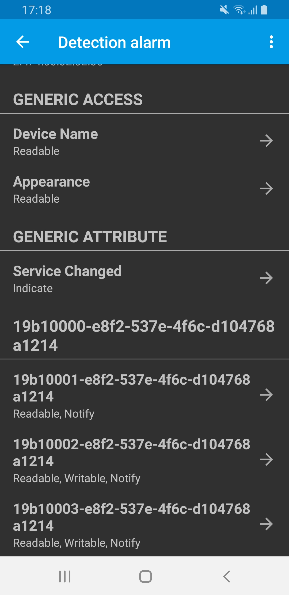
  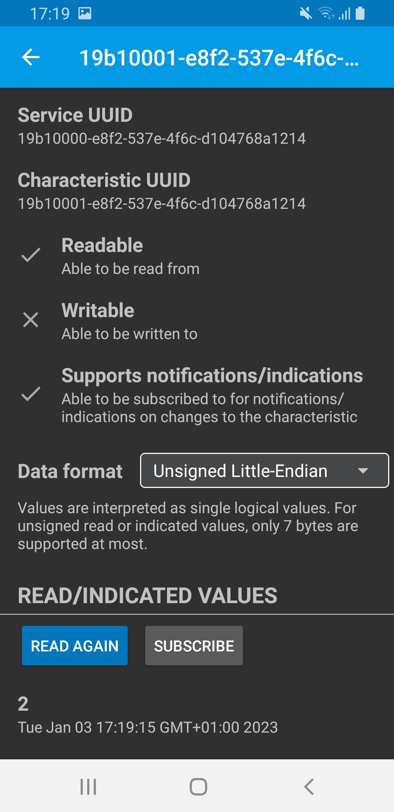
  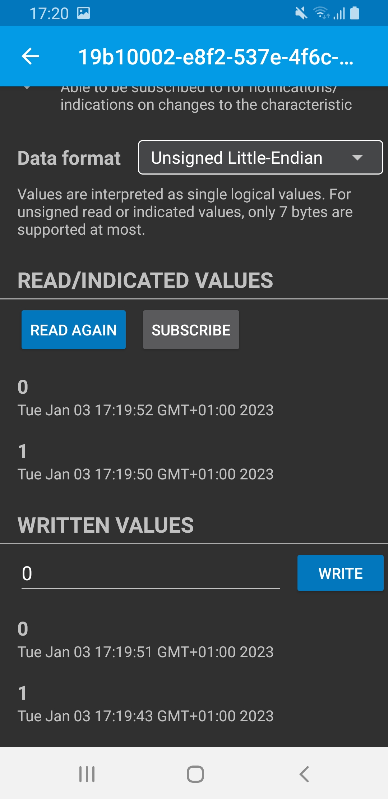
  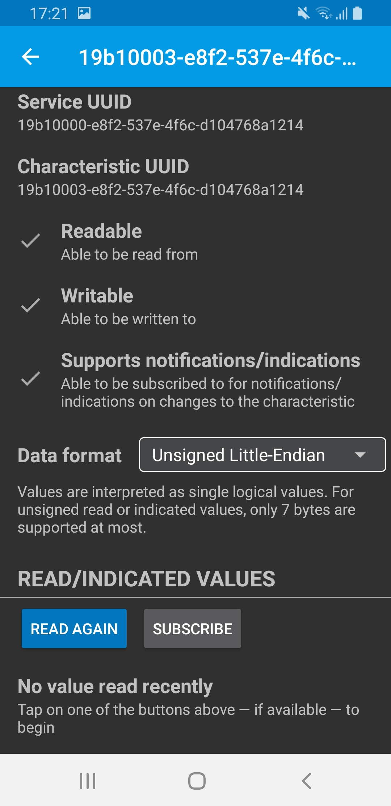
  <br>
  <i>Captures d'écran de l'application LightBlue avec notre système (services, lectures et écriture)</i>
</p>

Cette application nous a donc été très utile cependant elle ne dispose pas d'une interface claire et lisible pour un utilisateur lambda. 

Dans cette optique, nous avons décidé de créer une seconde application Android qui serait spécifiquement dédiée au projet. Cette application serait basique mais permettrait de mettre en forme les informations et communiquer avec les services Bluetooth dont dispose le système. N'ayant pas de connaissances particulières sur le développement d'application sous Android nous avons fait le choix de développer sous [MIT App Inventor](https://appinventor.mit.edu/). Ce site, à destination de l'enseignement, permet de développer une application Android très rapidement et simplement en définissant l'interface graphique puis le traitement à effectuer à l'aide de blocs à assembler (similaire à de la programmation de type Scratch). Afin de communiquer du smartphone au système, on utilise une librarie déjà concue nommée BluetoothLE et permettant d'exploiter la connexion en Bluetooth basse consommation.
L'application se présente donc sous la forme suivante : 

<p align="center">
  
  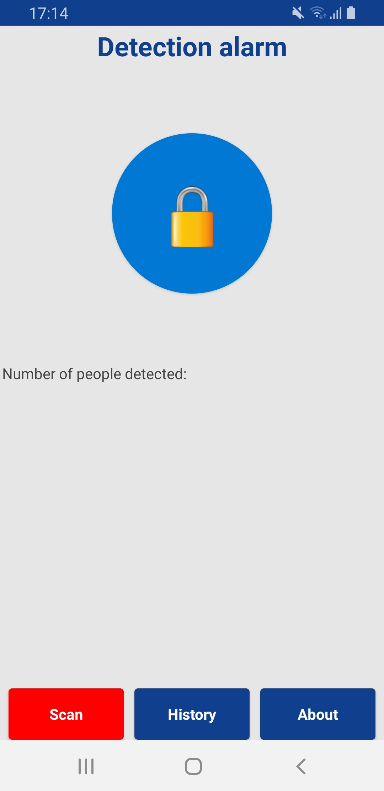
  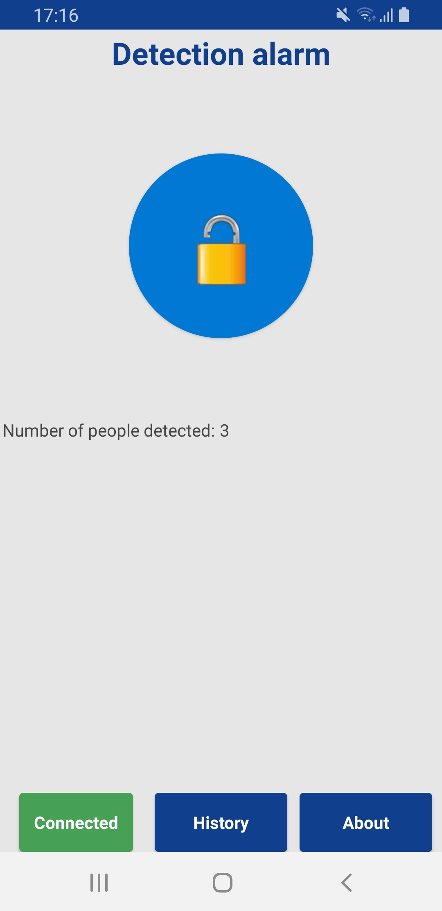
  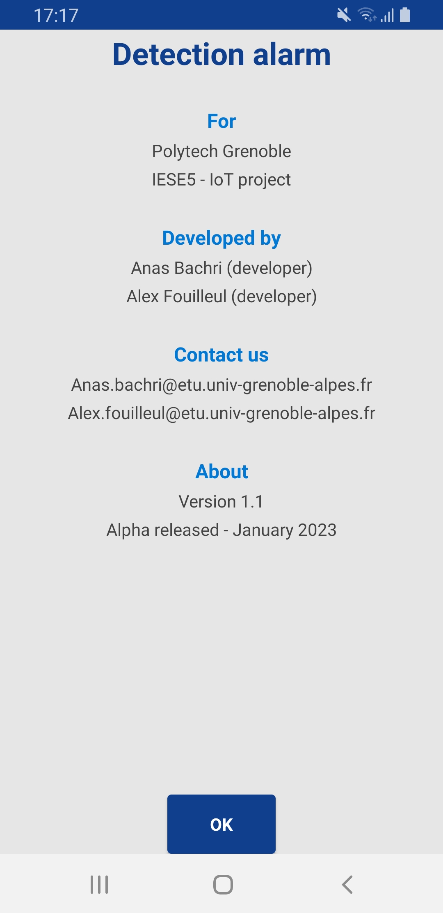
  <br>
  <i>Captures d'écran de l'application développé pour notre système (démarrage, en attente, connecté, à propos)</i>
</p>

On retrouve différents éléments constituant l'application dont un bouton en son centre permettant d'activer/désactiver l'alarme lors de son appui. Elle dispose également d'une barre de navigation en bas avec différents boutons permettant de sélectionner l'appareil sur lequel se connecter ainsi qu'un bouton permettant de voir l'historique des détections et enfin un bouton relatif aux informations de l'application.

A travers la mise en place de cette application nous en avons profité pour réaliser une charte graphique. Ainsi nous avons à côté définir le jeu de couleur que l'on utilise :
- couleur d'accentuation primaire : `#103f8d`
- couleur d'accentuation secondaire : `#0078d4`
- fond : `#e7e6e6`

Ces couleurs ont ensuite été utilisées aussi bien sur notre application, que sur notre logo ou encore sur notre dépôt GitHub.


## Problèmes rencontrés

Lors de la réalisation de ce projet différents problèmes se sont confrontés à nous. 

Dès le début du projet nous avons rencontré un problème lié à la limitation de l'utilisation de la caméra embarquée sur notre kit Arduino. Nous avons travaillé autour de ce capteur dans l'ambition de l'intégrer plus tard dans notre système. Notre objectif au début de ce projet était d'integrer la caméra pour réaliser ensuite un système capable de détecter des êtres humains à l'aide d'un modèle de réseau de neuronnes convolutionnels ( CNN ) du type YOLO net par exemple, l'idée était de réaliser une alarme de détection d'êtres humains, c'est-à-dire que l'alarme ne se déclanche que lorsqu'elle detecte la présence d'une personne, par exemple l'alarme ne se déclenchera pas si elle détecte un chat. Cependant lors de nos essais nous nous sommes rendus compte que le résultat obtenu est peu (voir pas) exploitable, la qualité de la caméra laissant grandement à désirer. Celle-ci étant un module de 0,3 MP pouvant gérer différentes résolutions de photos allant de 176 x 144 (QCIF) à 640 x 480 (VGA). Nous n'avons jamais pu tester la dernière résolution de caméra étant donné que notre Arduino ne dispose pas assez de stockage pour contenir l'image. Pour les autres résolutions on obtient des photos floues, peu détaillées à courte ou longue distance et avec une colorimétrie qui tend vers le vert comme en témoignent les photos ci-dessous.

<p align="center">
  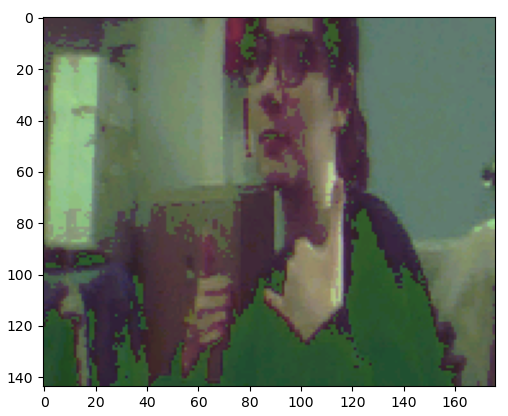
  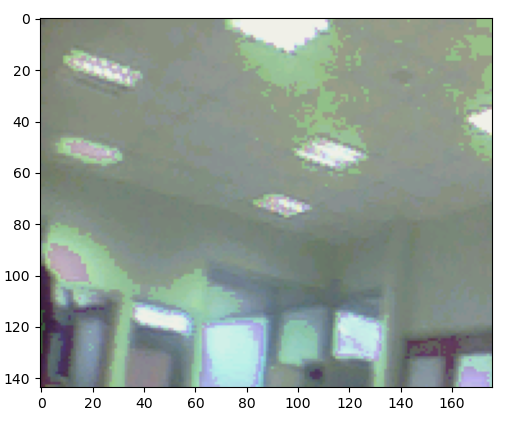
  <br>
  <i>Images obtenues lors de nos essais avec la caméra OV7675</i>
</p>

Nous nous sommes rendus compte qu'il est difficile de l'utiliser en temps réel. De plus, afin d'afficher l'image, celle-ci est renvoyée sous forme d'une immense chaîne de caractères pouvant faire à la fois planter l'Arduino, notre PC ou encore le logiciel Arduino IDE ainsi que le programme Python servant à l'affichage.

Un second problème sous forme de limitation hardware s'est également présenté avec l'introduction d'un bandeau de LED. En effet l'Arduino ne dispose que de tensions de 3.3V, il faut donc veiller à utiliser des capteurs fonctionnant avec cette tension (qui est d'habitude de l'ordre de 5V). Face à ce problème nous avons dans un premier temps essayé de faire un PCB permettant d'alimenter le bandeau de LED directement avec l'alimentation (partie puissance) et le contrôler par la suite avec l'Arduino (partie contrôle). Cependant cette solution n'a pas fonctionné car nous avons eu besoin d'un composant permettant de faire passer la commande de contrôle de l'Arduino de 3,3V à 5V (leveler shifter). En plus de rendre le système un peu plus complexe, nous n'avions tout simplement pas ce composant à disposition. Nous avons finalement choisis de retirer tout cela et, sous recommandations du responsable du FABLAB, alimenté directement les LED en 3.3V en faisant attention de limiter l'intensité d'éclairage du bandeau afin de ne pas tirer trop de courant étant donné la puissance que peut fournir l'Arduino.

Enfin un dernier problème que nous avons rencontré concerne l'application que nous avons développée. En effet, nous avons remarqué que celle-ci ne fonctionne pas sous Android 13 (version la plus récente à l'heure actuelle) à cause de problèmes de compatibilité et de limitations de sécurité qu'impose cette version. De plus, la librairie incluse dans l'application met en forme les données dans une forme différente que celles envoyées (confusion entre big-endian et little-endian). Ainsi pour la réception de données de l'Arduino au téléphone, le code mis en place est en mesure de remettre en forme les données avant affichage sur l'application. Cependant elle n'est pas en mesure d'en faire de même pour l'envoi de données du téléphone vers l'Arduino. Nous n'avons pas trouvé de solutions pour l'instant et pensons que la seule solution possible est de faire un traitement du côté de l'Arduino mais qui aurait pour conséquence de grandement alourdir le code présent.


## Conclusion

Ce projet a été pour nous l'occasion de développer de nouvelles compétences dans le domaine de l'IoT. Grâce à ces 4 séances de projet nous avons pu mettre en place un système comme celui-ci avec sa communication en Bluetooth, une application Android ainsi que sa mise en forme avec un boîtier réalisé à la découpeuse laser. De plus ce projet nous a permis de peaufiner notre maîtrise de GitHub en réalisant un projet complet dessus.
