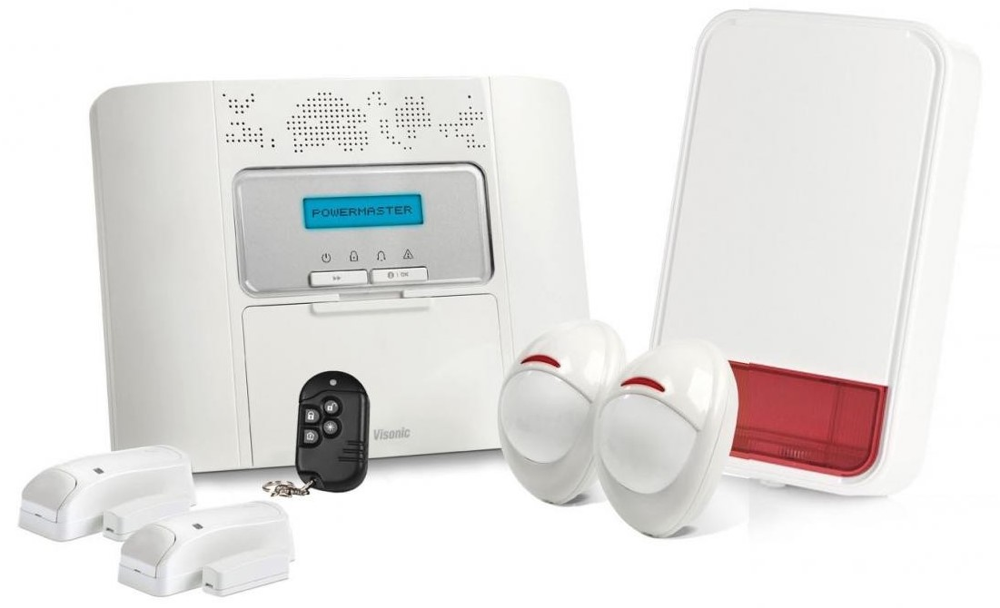

# Rapport mini-projet IoT

Bachri Anas
Alex Fouilleul 

Polytech Grenoble - IESE5
2022 - 2023

  

## Introduction

Nous avons disposé de quelques séances de TP réalisé au fablab MSTIC de l'UGA. Le but étant de créer un système "évolutif" prenant en compte des capteurs et réalisant une communication sans fils type LoRa ou encore Bluetooth.
Dans le cadre de ce projet nous avons choisis un compteur de personnes que nous avons très vite fait évoluer afin d'en faire une alarme de détection.

A noter que pour avoir un bref apercu du projet nous avons rédigé, en anglais, la page [readme.md](https://github.com/AlexFouilleul/Detection-alarm/blob/main/README.md) du dépot. Cependant ce compte rendu sera bien plus complet et expliquera les différents points pris en compte lors du travail autour de ce projet et son étude de cas.

## Analyse rapide du marché

Dans le cas d'une alarme, le prix des produits des concurrents peut très vite monter. Cela s'explique avant tout par les produits que ceux-ci propose (avec une centrale intérieure/extérieure ainsi que un ensemble de capteurs tels que des capteurs d'ouvertures de portes ou de détection de présence). En se référent au site de [Leroy Merlin](https://www.leroymerlin.fr/produits/electricite-domotique/alarme-telesurveillance/alarme-maison/alarme-maison-sans-fil/) on peut très vite se rendre compte des prix allant d'une centraine d'euros jusqu'au millier d'euros. A noter que ce genre d'alarme  est en général très robuste avec des équipments robuste résistant au temps. Elles sont donc pensées pour une durée de vie de plusieurs dizaines d'années avec en général et une sécurité et fiabilité relativement élevées.

  
   
  <u>Alarme classique : PowerMaster Kit4</u>

Un autre type de système tout aussi intéréssant sur lequel on peut se pencher sont les centrales domotiques tel que la [Gateway Xiaomi](https://xifrance.com/product/xiaomi-gateway-v3/). Ce genre de produit repose sur la même approche que les alarmes avec une centrale intérieure et un ensemble de capteurs qui s'y connecte en utilisant différents protocoles tel que le Wifi (pour piloter la centrale à distance), ainsi que le Bluetooth et le Zigbee pour se connecter aux capteurs. Ce type de système peut être utilisé comme une alarme d'appoint et dispose de nombreux avantages qui seront énumérés plus bas dans ce compte rendu.

  
   
  <u>Centrale domotique : Xiaomi Mijia Gateway V3</u>

Avec les quelques séances de projet dont nous disposons, nous avons fait le choix de mélanger les deux types d'alarme vu précédemment et de concevoir un boitier unique disposant de l'ensemble des capteurs dont nous avons besoin. Cette solution nous permettra de développer rapidement le système et le tester tout en pouvant toucher aux différents aspects de ce projet et respecter des contraintes de ressources et de coûts.

## Architecture globale du système

L'idée étant d'avoir une solution clé en main, l'objet est donc un boitier contenant l'ensemble du système. 
Afin de le mettre en place il faut donc les éléments suivants : 
- Le boitier contenant le système
- Une surface sur laquelle fixer le boitier
- Une alimentation (comprise entre 3 et 20V) ou un chargeur de téléphone (5V) et un cable micro-USB

Le but étant de placer le boitier à une distance relativement haute afin qu'il ne puisse être atteint trop rapidement.

### Fonctionnalités

Le système ainsi installé est capable de réaliser les fonctionnalités suivantes :
- Détection de personnes avec un angle de 120 degrés à une distance maximum de 6 mètres.
- Retourne d'informations avec un effet de lumière grâce au bandeau de LED :
  - Lumière totalement bleu = le système est connecté au Bluetooth et l'alarme est innactive.
  - Lumière bleu au centre et rouge aux extrémitésé = le système est connecté au Bluetooth et l'alarme sera active après déconnexion.
  - Lumière rouge avec pulsations = le système a détecté quelqu'un et l'alarme sonne.
- Détection de fixation au mur. Si une personne décroche le système du mur, l'alarme le détecte et sonne.
- Communication Bluetooth basse consommation.
- Peu couteux
- Controlable avec une application Android permettant de :
  - Activer/désactiver l'alarme.
  - Voir combien de personnes ont été détectées.
  - Voir l'historique des détections.

## Sécurité globale

(à rédiger)

## Respect de la vie privée (RGPD)

(à rédiger)

## Architecture matérielle de l'objet

Afin de mener à bien ce projet nous avons utilisé différents éléments qui sont les suivants :
- Un [Arduino Tiny Machine Learning Kit](https://store.arduino.cc/products/arduino-tiny-machine-learning-kit) qui est basé sur une Arduino Nano 33 BLE Lite. Cette carte est spécifiquement concu pour les projets IoT. En effet, elle dispose de nombreux éléments dont : 
  - une connection BLE (Bluetooth Low Energy) : utilisé afin d'envoyer des informations au smartphone.
  - un capteur faisant office d'accéléromètre, magnétomètre et gyroscope : non utilisé dans notre projet car le boitier sera fixé.
  - un capteur de proximité : non utilisé car son utilisation est limitée dans le cadre de notre projet.
  - un microphone omnidirentionnel : non utilisé pour l'instant mais qui pourra être intégré plus tard.
- Un [Grove buzzer](https://wiki.seeedstudio.com/Grove-Buzzer/) permettant de jouer des sons.
- Un [Grove PIR sensor](https://wiki.seeedstudio.com/Grove-PIR_Motion_Sensor/) afin de détecter la présence d'une personne.
- Un [Grove bouton](https://wiki.seeedstudio.com/Grove-Button/) qui a pour but de vérifier que le boitier est bien fixé au mur.
- Un bandeau de LED addressables WS2812B permettant un retour d'informations visuelles

D'autres éléments sont également utilisés comme :
- Une alimentation mise en place à l'aide d'un chargeur de téléphone et un cable micro-USB.
- Un boitier concu à l'aide d'une découpeuse laser et d'une plaque de contreplaqué de 3 mm.

<u>Remarque :</u> On notera que l'Arduino ne peut fournir qu'une tension de 3,3V.

## Estimation de la BOM de notre produit

(à rédiger - basé sur 5000 unités produites)

La BOM est la liste compète de toutes les pièces et matières utilisée afin de fabriquer ce produit. Pour la réaliser, on se base sur une estimation de production de l'ordre de 5000 unités produites. On dresse alors le tableau suivant :

| Matériel | Quantité | Prix unitaire | Prix de groupe | Revendeur | Remarque |
| -------- | -------- | ------------- | -------------- | --------- | -------- |
| Arduino Tiny Machine Learning Kit | 5000 | 50,40 € | 252 000 € | [Arduino](https://store.arduino.cc/products/arduino-tiny-machine-learning-kit) | Cable micro USB inclus |
| Buzzer Grove | 5000 | 1,06 € | 5 300 € | [SeeedStudio](https://www.seeedstudio.com/Grove-Buzzer.html) | |
| Bouton Grove | 5000 | 1,30 € | 6 500 € | [SeeedStudio](https://www.seeedstudio.com/Grove-Button.html) | |
| PIR Grove | 5000 | 6,10 € | 30 500 € | [SeeedStudio](https://www.seeedstudio.com/Grove-PIR-Motion-Sensor.html) | |
| Cable Grove  | 4000 | 2,20 € | 8 800 € | [SeeedStudio](https://www.seeedstudio.com/Grove-Universal-4-Pin-20cm-Unbuckled-Cable-5-PCs-Pack-p-749.html) | Lot de 5 cable Grove de 20 cm |
| Bandeau LED WS2812B | 100 | 14,69 € | 1 469 € | [Aliexpress](https://fr.aliexpress.com/item/1005002890783311.html) | Longueur 5m - Densité 60LED/m - Protection IP65 |
| Chargeur de téléphone | 5000 | 4,84 € | 24 200 € | [RS Components](https://fr.rs-online.com/web/p/adaptateurs-ac-dc/2237481) | Puissance : 5V - 1A |
| Contreplaqué | 455 | 16,59€ | 7 549 € | [Leroy Merlin](https://www.leroymerlin.fr/produits/menuiserie/panneau-planche-et-materiaux-bois/panneau-bois-agglomere-mdf/panneau-bois-recoupable/panneau-contreplaque-peuplier-ep-3-mm-x-l-100-x-75-cm-82707642.html) | Surface unitaire = ~675 cm² |
| Vis | 38 | 6,90 € | 263 € | [Leroy Merlin](https://www.leroymerlin.fr/produits/quincaillerie/cheville-vis-clou-et-boulon/vis/vis-a-bois/lot-de-400-vis-acier-tete-fraisee-standers-diam-4-mm-x-l-16-mm-82231848.html) | Lot de 400 vis avec un diamètre de la tige de 4 mm |
| Colle à bois | 50 | 9,90€ | 495 € | [Leroy Merlin](https://www.leroymerlin.fr/produits/peinture-droguerie/colle-et-adhesif/colle/colle-a-bois/colle-a-bois-rapide-axton-500-gr-80104801.html) | |

Ce qui nous donne un total de **337 076 €** à débourser pour concevoir 5000 unités. Quant au prix unitaire celui-ci reviens donc à **67,42 €**.

A noter que l'on utlise ici des revendeurs officiels sauf pour le bandeau de LED introuvable sur ce genre de site. 
De plus certains prix pourrait être revu à la baisse en faisant de l'optimisation (nottament avec l'espace lié à la découpeuse laser). 
Les prix peuvent également être négocié étant donné l'achat de groupe conséquent fait pour 5000 unités et que les sites actuels ne prennent pas en compte.

La BOM réalisée ci-dessus ne prend pas en compte les coûts liés à l'utilisation des machines du type découpeuse laser ou encore la main d'oeuvre pour l'assemblage de l'ensemble.

## Estimation du cout des certifications

(à rédiger)

## Implémentation logiciel embarqué de l'objet défini

(à rédiger)

## Format des messages échangés

(ajouter schéma d'échange d'infos)

## Définition du logiciel embarqué de l'objet

(à rédiger)

## Métriques du logiciel embarqué

(à rédiger)

## Mesure des temps d'éxécution des phases d'éxécution

(à rédiger)

## Estimation de la durée de vie de l'objet

(à rédiger)

## Analyse du cycle de vie du produit (ACV)

(à rédiger)

## Recherche et analyse des produits concurrents

Dans cette partie nous comparons les différents produits vis à vis du notre. L'idée n'est pas de cibler un produit en particulier mais plutot une gamme de produit afin d'éviter d'avoir un tableau redondant étant donné qu'ils existent de nombreuses alarme à détection et qu'elles se valent toutes plus ou moins dans les grandes lignes.

| Produit              | Avantages                                                                    | Inconvénients                                               |
| -------------------- | ---------------------------------------------------------------------------- | ----------------------------------------------------------- |
| Alarme classique     | <ul><li>Fiabilité</li><li>Robustesse</li></ul>                               | <ul><li>Prix (100 à 1500€)</li></ul>                        |
| Centrale domotique   | <ul><li>Prix(40€ la centrale, ~10€ le capteur)</li><li>Evolutivité</li></ul> | <ul><li>Facilement désactivable</li></ul>                   |
| Notre alarme         | <ul><li>Peu couteux</li><li>Open Source</li></ul>                            | <ul><li>Prototype</li><li>Facilement désactivable</li></ul> |

## Intégrations effectuées

Afin de communiquer avec le système une première intégration a été mise en place à travers l'application "[LightBlue® - Bluetooth Low Energy](https://play.google.com/store/apps/details?id=com.punchthrough.lightblueexplorer&hl=fr&gl=US&pli=1)" disponible seuelement Google Play Store pour les téléphones Android. 
Cette application permet de se connecter à n'importe quel appareil utilisant le protocole Bluetooth Low Energy. Grâce à celle-ci nous sommes donc en mesure de détecter le ou les services Bluetooth que propose le système. Elle a été spécifiquement concu pour les développeurs, ainsi pour chaque service on peut venir lire, écrire ou être notifié en fonction de comment le service a été défini dans le code auparavant. De plus on peut gérer l'envoi sous différentes forme (binaire, hexa, caractère, signed/unsigned ou encore little/big endian). 
Cette application nous a donc été très utile cependant elle ne dispose pas d'une interface claire et lisible pour un utilisateur lambda. 

Dans cette optique nous avons décidé de créer une seconde application Android qui serait spécifiquement dédié au projet. Cette application serait basique mais permettrait de mettre en forme les informations et communiquer avec les services Bluetooth dont dispose le système. N'ayant pas de connaissances particulières sur le développement d'application sous Android nous avons fait le choix de développer sous [MIT App Inventor](https://appinventor.mit.edu/). 

(continuer de développer la partie app + intégrer capture d'écran)

## Problèmes rencontrés

Lors de la réalisation de ce projet différents problèmes se sont confrontés à nous. 

Dès le début du projet nous avons rencontré un problème lié à la limitation de l'utilisation de la caméra embarqué sur notre kit Arduino. Nous nous sommes rendus compte qu'il est difficile de l'utiliser en temps réel. De plus afin d'afficher l'image celle-ci est renvoyé sous forme d'une immense chaine de caractères pouvant faire à la fois planter l'Arduino, notre PC ou encore le logiciel Arduino IDE ainsi que le programme Python servant à l'affichage.

Un second problème sous forme de limitation hardware s'est également présenté avec l'introduction d'un bandeau de LED. En effet l'Arduino ne dispose que de tensions de 3.3V, il faut donc veiller à utiliser des capteurs fonctionnant avec cette tension (qui est d'habitude de l'ordre de 5V). Face à ce problème nous avons dans un premier temps essayé de faire un PCB permettant d'alimenter le bandeau de LED directement avec l'alimentation (partie puissance) et le controler par la suite avec l'Arduino (partie contrôle). Cependant cette solution n'a pas fonctionné car nous avons eu besoin d'un composant permettant de faire passer la commande de contrôle de l'Arduino de 3,3V à 5V (leveler shifter). En plus de rendre le système un peu plus complexe, nous n'avions tout simplement pas ce composant à disposition. Nous avons finalement choisis de retirer tout cela et, sous recommandations du responsable du FABLAB, alimenté directement les LED en 3.3V en faisant attention de limiter l'intensité d'éclairage du bandeau afin de ne pas tirer trop de courant étant donné la puissance que peut fournir l'Arduino.

Enfin un dernier problème que nous avons rencontré concerne l'application que nous avons développé. En effet nous avons remarqué que celle-ci ne fonctionne pas sous Android 13 (version la plus récente à l'heure actuelle) à cause de problème de compatibilité et de limitations de sécurité qu'impose cette version. De plus la librairie incluse dans l'application mets en forme les données dans une forme différente que celles envoyées (confusion entre big-endian et little-endian). Ainsi pour la récéption de données de l'Arduino au téléphone, le code mis en place est en mesure de remettre en forme les données avant affichage sur l'application. Cependant elle n'est pas en mesure d'en faire de même pour l'envoi de données du téléphone vers l'Arduino. Nous n'avons pas trouvé de solutions pour l'instant et pensons que la seule solutions possibles est de faire un traitement du coté de l'Arduino mais qui aurait pour conséquence de grandement alourdir le code présent.

## Nombre de lignes de code développé

Afin de mettre à bien ce projet nous avons rédigé 112 lignes de code en C sous l'IDE Arduino. Afin de réduire ce nombre de ligne de code nous avons utilisé des librairies déjà concu et permettant de grandement gagner du temps face au peu de temps dont nous disposons. 

Concernant l'application développé sous MIT App Inventor celle-ci ne fonctionne pas sous forme de ligne de code mais sous forme de blocs à empiler (façon Scratch). Par conséquent il est difficile de quantifier le travail réalisé mais nous avons cependant essayé de faire des blocs génériques afin qu'ils puissent facilement s'adapter aux services Bluetooth dont nous disposons. Cette démarche nous a ainsi permis de gagner du temps là encore.

L'ensemble du code est disponible dans les répertoires [Arduino](https://github.com/AlexFouilleul/Detection-alarm/tree/main/Arduino) et [Application](https://github.com/AlexFouilleul/Detection-alarm/tree/main/Application). 
